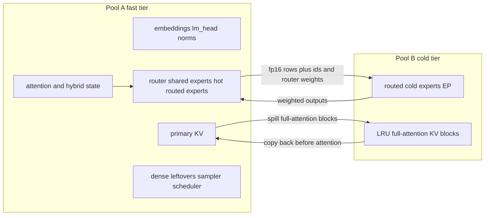

# Hetero MoE: RDNA3 fast tier, RDNA2 cold experts

Serve-side only. Default off (`VLLM_HETERO_MOE=0`). With the flag unset,
`RoutedExperts.forward_modular` calls `quant_method.apply` and does not
import `vllm/distributed/hetero_moe/`. Clients (LiteLLM, OmO) keep one
OpenAI endpoint and never see these knobs.

This is attention / expert disaggregation, not a new kernel. gfx1100 hot
experts stay on the existing Triton W4A16 MoE path. gfx1030 cold experts
stay on `RDNA2W4A16MoEExperts` / `moe_gptq_gemm_rdna2` (fdot2). The two
fatbins are separate. A gfx1100 process must not load a gfx1030 DOT object.

## Pools



Pool A in this tree is 2x W7800 (gfx1100, 48GB). The device class is
pluggable (`resolve_fast_tier`). `gb10` / Spark GB10 is registered and
raises `NotImplementedError`. It is not a silent alias of gfx1100.

Pool A owns embeddings, `lm_head`, norms, the router, shared experts,
hot routed experts, all attention and hybrid state, dense leftovers,
leftover BF16 tensors, the sampler, the scheduler, and the primary KV.
Qwen4Exp QSA main KV and its compressed-key / indexer heap are one
layer-class heap (`qsa_heap`). GDN rings, PLE, and HC stay here too.

Pool B is 8x V620 (gfx1030, 32GB). It owns routed cold experts, sharded
expert-parallel with the contiguous map in `cold_ep.py`, and the LRU KV
block store. It does not own shared experts, the router, or recurrent
state.

## What this follows

* **MegaScale-Infer** (Zhu et al., arXiv:2504.02263, SIGCOMM 2025)
  disaggregates attention and FFN and uses ping-pong pipeline
  parallelism: a batch is split into micro-batches so the expert hop of
  one overlaps attention of the next.
  <https://arxiv.org/abs/2504.02263>
* **Step-3 / AFD / StepMesh** (arXiv:2507.19427) splits attention and
  FFN onto different workers. StepMesh is the low-latency AFD transport
  (`AFTensorWorker.PushPull`, `AFTensorServer.GetBatch` / `Respond`).
  <https://arxiv.org/abs/2507.19427>
  <https://github.com/stepfun-ai/StepMesh>
* **vLLM AFD** ships as an external plugin, not as this fork's runtime.
  Requests stay on the attention server; FFN workers have no HTTP
  traffic. <https://github.com/vllm-project/afd-plugin> and
  <https://vllm.ai/blog/2026-07-23-vllm-afd-plugin>. That plugin sends
  the whole FFN. This path sends only cold `(token, expert)` pairs and
  keeps hot experts on the fast tier. It does not depend on RCCL
  collectives across gfx1100 and gfx1030.
* **vLLM EP / EPLB** (`docs/serving/expert_parallel_deployment.md`,
  `--enable-eplb`) rebalances experts inside one pool. The cold pool
  here is a static contiguous shard. Hot-set updates are a separate
  LFU/EMA placement and run between steps, never inside graph capture.
* **`--cpu-offload-params` / `--offload-params`** move named weight
  segments to host memory (`UVAOffloadConfig`, `PrefetchOffloadConfig`).
  That is a different mechanism. Cold experts here live on gfx1030
  VRAM, not in the CPU offload group.
* **KV connector API.** `KVConnectorBase_V1` is the scheduler/worker
  split. `LMCacheConnectorV1` and `OffloadingConnector` are the
  in-tree cache and offload connectors. `HeteroKVTierConnector`
  follows that shape and returns no prefix hits.
* **Expert residency.** Draft PR #37
  (`ExpertResidencyCache.prepare`, `after_resident_gemm`,
  `next_moe_index`, `should_engage_expert_offload`) is the only cold
  expert cache. `ResidencyBridge` calls it. This module does not
  allocate slots or host pages of its own.
  `VLLM_RDNA_MOE_RESIDENT` is the full-weight native layout, not this
  cache. PR #37 leaves the cache off when that flag is on.

## Data flow per MoE layer

1. The fast tier has already run embeddings, attention (QSA / GDN / PLE
   / HC as the layer requires), norms, and the router.
2. `partition_pairs` splits `(token, expert)` using the hot set from
   the previous between-step placement. Padding ids (`< 0`) are neither
   hot nor cold.
3. Hot pairs run on the fast tier through the layer's existing
   `quant_method.apply`, with cold ids set to `-1` and their router
   weights set to 0. Shared experts are passed only to this call.
4. If the cold set is empty, there is no send.
5. Otherwise the side stream stages fp16 hidden rows (one row per cold
   pair), int expert ids, and router weights. `send` returns without
   waiting. `recv` is the wait, and it is outside graph capture.
6. Weighted cold outputs are added onto the matching token rows
   (`combine_rows`, float64 accumulator, then the local dtype).

Routing ids for the hot-set histogram are kept on the tensor until
`HeteroRuntime.finish_step`, which runs between engine steps. That
method updates the LFU counts and the EMA and re-places under the
per-device byte budget. Experts that have never been routed stay cold.
Re-placement raises if a capture is active.

Ping-pong, for two micro-batches and a non-empty cold set:

```text
attn(mb0) -> send(mb0) -> attn(mb1) -> recv(mb0) -> send(mb1) -> recv(mb1)
```

`run_ping_pong` is that schedule. `split_routed_forward` still finishes
its own receive before returning, so a single forward stays a correct
combine. The GPU model runner's ubatch loop is not rewritten.

## Bytes and round trips

Symbols only. `Bandwidth` and `Latency` are names for whatever
`tools/rdna2/probe_hetero_peer.py` measures on a machine. This document
does not assign them numbers.

```text
activation_bytes(layer) = hidden_size * 2 * cold_pairs(layer)
round_trips(decode step, one micro-batch) = num_moe_layers
```

A layer with `cold_pairs = 0` skips its send. The count above is the
upper bound, one round trip per MoE layer.

Per cold pair the activation row is `hidden_size * 2` bytes (fp16).
The send also carries the expert id and the router weight. The receive
is one weighted fp16 row per cold pair, `hidden_size * 2 * cold_pairs`
again.

```text
T_xfer(layer) = (bytes_send(layer) + bytes_recv(layer)) / Bandwidth + Latency
```

Ping-pong hides a transfer behind the next micro-batch's attention when
that attention is longer than the transfer. The exposed leftover is:

```text
max(0, T_xfer(layer) - T_attn(next micro-batch))
```

No value of `Bandwidth`, `Latency`, or `T_attn` is claimed here.

## KV tier

`HeteroKVTier` is an LRU map from block hash to a payload on the cold
pool. `prepare_for_attention` pops the block back into the fast map
before attention. `remote_read` always raises: QSA and full-attention
pages are not read across the link.

Refused groups: GDN, PLE, recurrent / mamba / KDA / SSM. A QSA main
block or a compressed-key heap alone is also refused. `evict_qsa_heap`
stores both halves under one LRU key (two slots). If the capacity
cannot hold both, it stores neither.

`HeteroKVTierConnector.get_num_new_matched_tokens` returns `(0, False)`.
Automatic prefix caching is off on this tree after the 2026-09-15
prefix corruption (`docs/rdna2/flash-next-prefix-cache-corruption.md`,
`--no-enable-prefix-caching`). The tier helps preemption swap and
long-context spill, not prefix reuse.

The connector's in-process tier is the tested policy. It does not copy
paged KV onto a V620 by itself.

## Knobs

Set on the server or the launcher. All default off except the transport
name, which is read only after the master flag is on.

| Knob | Default | Role |
| --- | --- | --- |
| `VLLM_HETERO_MOE` / `--hetero-moe` | off | Master switch |
| `VLLM_HETERO_MOE_FAST_TIER` / `--hetero-moe-fast-tier` | `gfx1100` | Fast-tier class |
| `VLLM_HETERO_MOE_COLD_DEVICES` / `--hetero-moe-cold-devices` | `8` | gfx1030 EP width |
| `VLLM_HETERO_MOE_TRANSPORT` / `--hetero-moe-transport` | `host_staged` | `loopback`, `host_staged`, or `peer` |
| `VLLM_HETERO_MOE_HOST_LINK` / `--hetero-moe-host-link` | `local` | `local`, `shm`, or `tcp` |
| `VLLM_HETERO_MOE_HOST_ADDR` / `--hetero-moe-host-addr` | empty | `host:port` for TCP |
| `VLLM_HETERO_MOE_HOT_BUDGET_BYTES` / `--hetero-moe-hot-budget-bytes` | `0` | Per-device hot VRAM. `0` places no hot experts |
| `VLLM_HETERO_MOE_EMA_ALPHA` / `--hetero-moe-ema-alpha` | `0.2` | EMA rate |
| `VLLM_HETERO_MOE_KV_TIER` / `--hetero-moe-kv-tier` | off | Register the spill policy |
| `VLLM_HETERO_MOE_KV_CAPACITY_BLOCKS` | `0` | Cold KV slots |
| `VLLM_HETERO_MOE_PEER_PROBE` / `--hetero-moe-peer-probe` | empty | Probe JSON. Required for `peer` |

CLI defaults do not clobber an exported variable. `--hetero-moe` sets
`VLLM_HETERO_MOE=1` and leaves it unset when the flag is absent.

KV connector name, if the tier is enabled: `HeteroKVTierConnector`.

## Fatbins

ROCm pin: **7.14.0**.

gfx1030 compile line:

```text
hipcc --offload-arch=gfx1030 -O3 -mno-wavefrontsize64
```

Do not pass `-ffp-contract=off`. gfx1100 is a second build
(`--offload-arch=gfx1100`). `assert_device_kernel` refuses
`moe_gptq_gemm_rdna2` and `RDNA2W4A16MoEExperts` on gfx1100, and refuses
any other kernel name on gfx1030.

## Bring-up

1. On the machine, run `tools/rdna2/probe_hetero_peer.py` and keep the
   JSON. If it says bandwidth was not measured, leave the transport on
   `host_staged`. Do not type a bandwidth into the config.
2. Start with `VLLM_HETERO_MOE=1` and the default `host_staged` link
   (`local` on one host). Peer stays off.
3. Confirm the gfx1100 process does not have `moe_gptq_gemm_rdna2`
   loaded, and the gfx1030 process does. Two fatbins.
4. One MoE layer, loopback or host-staged, against an all-local W4A16
   forward of the same ids. The CPU test
   `test_split_matches_all_local_on_loopback` is the algebraic check,
   not a device check.
5. Only then a full model. APC stays off. KV spill after the MoE path
   is trusted.
6. `peer` only if the probe JSON has `passed` and `measured` and both
   directions of `hipDeviceCanAccessPeer`. The transport status string
   remains `UNVERIFIED`. Do not enable mixed-arch RCCL.

## Known risks

* No ROCm run and no mixed gfx1100/gfx1030 peer measurement exist in
  this change. `hipDeviceCanAccessPeer` across those arches is an open
  question the probe is there to answer.
* RCCL collectives across the two arches are not implemented and must
  not be assumed.
* The hot path depends on the existing MoE kernel treating top-k id
  `-1` as padding. That is the CPU reference's contract. It is not
  re-checked against `moe_gptq_gemm_rdna2` here.
* PR #37 is not on `rdna_extras`. The residency bridge imports that
  module and raises if it is missing. There is no fallback cache.
* `finish_step` is not called by the GPU model runner yet. Until a
  runner calls it, the placed hot set stays empty and every routed
  expert is cold.
* `run_ping_pong` is not spliced into the ubatch loop. A single
  `split_routed_forward` does not overlap the next micro-batch.
* Graph capture raises. Piecewise mode is required if graphs stay on,
  and that wiring is not in `gpu_model_runner`.
* Partition reads routing ids on the host. That sync is illegal inside
  capture and is guarded. It still happens between captures.
* A budget of 0 keeps the hot set empty. Set
  `VLLM_HETERO_MOE_HOT_BUDGET_BYTES` or the first enabled step sends
  every routed pair.
* QSA heap spill needs two cold slots. A one-slot tier refuses the
  heap rather than splitting it.
* The KV connector does not move real paged-KV storage onto a V620.
* TCP on a second host is the length-prefixed frame. It was exercised
  as localhost in the CPU test, not across two machines.
* W4A16 on gfx1100 is the existing Triton path by name
  (`triton_wna16`). This change does not launch it.

## Open questions

* One host for both pools, or a second host reached by the TCP frame?
* Fast tier stays 2x W7800 (gfx1100), or moves to Spark GB10 later?
* Which checkpoint is the first full-model target (Qwen4Exp / Qwen3.8
  Flash-Next W4A16 is the kernel this tree already runs on gfx1030)?
